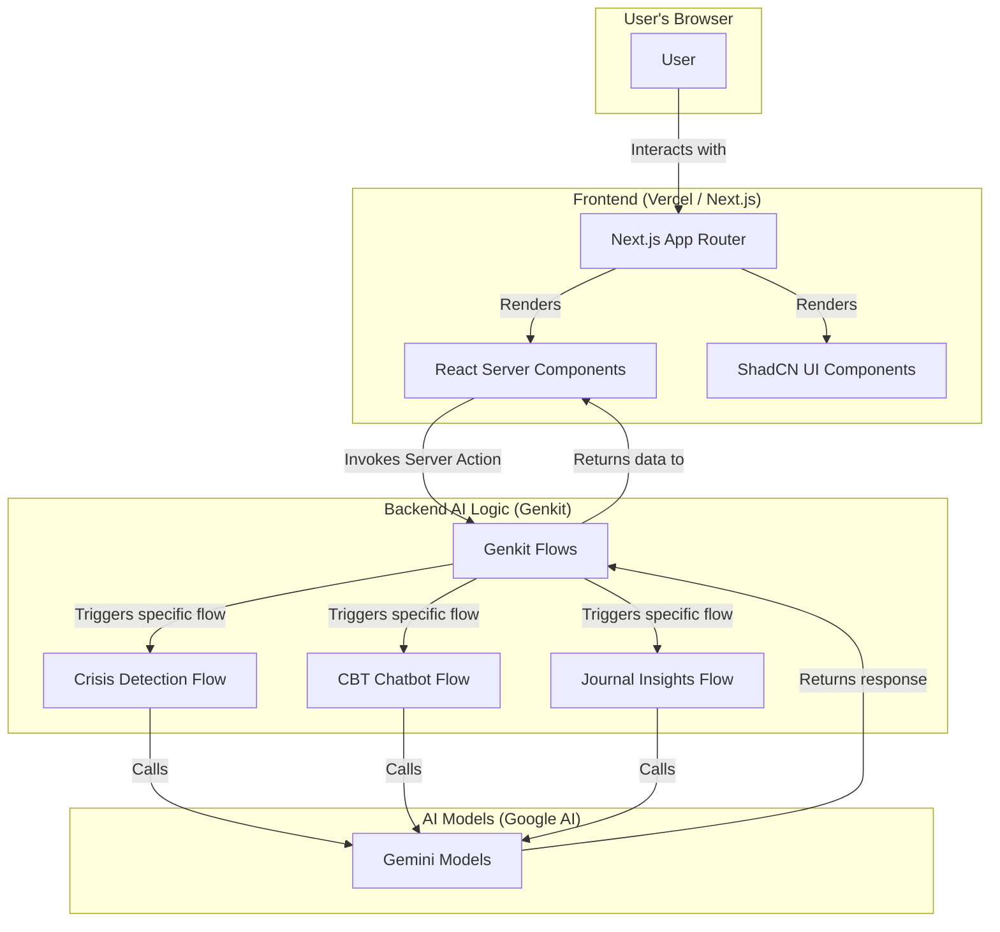
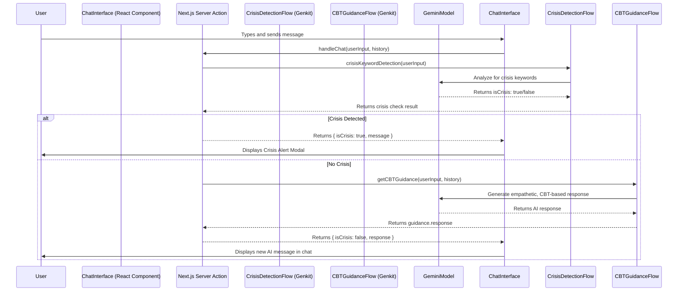
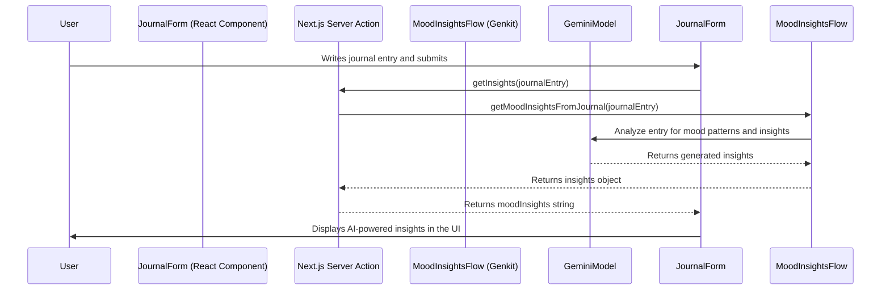

# Saarthi - Your Companion for Mental Well-being


**Saarthi** is a comprehensive, AI-powered mental wellness platform designed as a "digital public good" to address the significant mental health treatment gap among adolescents and young adults in India. It integrates evidence-based AI tools with a culturally sensitive, multi-tiered support system to provide accessible, affordable, and stigma-free mental health care.

## Core Problem

Mental health is a critical issue among Indian youth, driven by academic stress, family expectations, and the challenges of the digital age. Key issues include:
- **High Prevalence, Low Treatment:** A vast number of young people experience mental health issues, yet a massive treatment gap exists.
- **Significant Stigma:** Social stigma remains a major barrier to seeking help.
- **Systemic Gaps:** Existing school and college mental health programs are often underfunded and lack the resources to provide continuous support.

## The Saarthi Solution: A 3-Tiered Approach

Saarthi provides a "stepped care" model, offering different levels of support based on individual user needs.

### Tier 1: Universal Self-Care & Mental Health Literacy
The free, accessible entry point for proactive self-care and building resilience.
- **AI Conversational Assistant:** A 24/7 AI chatbot providing empathetic conversations, psychoeducation, and guidance on coping strategies (CBT, mindfulness).
- **Clinically Validated Self-Assessments:** Confidential tools like PHQ-9, SDQ, and the Internet Addiction Test (IAT) to help users understand their mental state.
- **Mood & Emotion Journal:** An AI-powered journal to track mood patterns and gain personalized insights.
- **Hyper-Localized Content Hub:** A library of articles and guides in English and Assamese on relevant topics like stress management and healthy digital habits.

### Tier 2: Targeted Peer & Community Support
For users who may benefit from a sense of community and shared experience.
- **Anonymous Peer Support Circles:** Moderated, themed discussion forums where users can connect anonymously with peers facing similar challenges.
- **Teacher & Parent Portal:** A resource hub with micro-learning modules to equip teachers and parents with mental health literacy.
- **Community Challenges:** Optional, positive challenges (e.g., "7-Day Gratitude Journal") to foster engagement and healthy habits.

### Tier 3: Professional Care & Crisis Intervention
A clear and safe escalation path for users requiring professional help.
- **Crisis Intervention:** The AI is trained to detect crisis language and immediately provides a direct, one-tap connection to India's national **Tele-MANAS (14416)** helpline.
- **Find a Therapist:** A directory of verified, licensed therapists and counselors, providing users with clear pathways to connect with:
    1. Free TELE-MANAS Counselors.
    2. Anonymous College Counselors (for partner institutions).
    3. Vetted Paid Counselors for specialized therapy.

## Technical Architecture

Saarthi is built on a modern, scalable, and secure technical stack designed for a high-quality user experience and robust AI capabilities.

### High-Level System Overview

The architecture separates the user-facing application from the AI logic. The Next.js frontend provides a reactive and responsive user experience, while Genkit manages all interactions with the underlying AI models (Gemini) in a structured and maintainable way.



### Core Components

-   **Frontend:**
    -   **Next.js with App Router:** Provides a modern, performant foundation with server-side rendering and client-side navigation.
    -   **React & TypeScript:** Ensures a type-safe and component-based UI.
    -   **ShadCN UI & Tailwind CSS:** Delivers a custom, aesthetically pleasing design system that is accessible and responsive.

-   **Backend AI Flows (Genkit):**
    -   **Genkit:** A Google AI framework used to define, run, and manage all AI-powered logic. It orchestrates calls to AI models, defines data schemas (using Zod), and structures the AI interactions into manageable "flows."
    -   **AI Models (Gemini):** Google's powerful language models are used for all generative tasks, including the conversational AI, summarization, and insight generation.

-   **Database (Envisioned for Production):**
    -   A dual-database model is planned for a full production environment to optimize for different data types.
    -   **PostgreSQL:** For structured, relational data such as user profiles, assessment scores, and journal metadata.
    -   **MongoDB:** For unstructured data, specifically the chat logs from the AI Assistant, allowing for flexible storage and analysis.

### Key Data Flows

#### 1. AI Chatbot Interaction

This flow outlines how a user's message is processed, checked for crisis indicators, and responded to by the CBT-trained AI.



#### 2. Mood Journal Insights

This flow shows how a user's journal entry is analyzed to provide personalized reflections.



## Getting Started

To get the project up and running on your local machine, follow these steps.

### Prerequisites
- Node.js (v18 or later)
- npm or yarn

### Installation & Setup

1. **Clone the repository:**
   ```bash
   git clone https://github.com/your-repo/saarthi.git
   cd saarthi
   ```

2. **Install dependencies:**
   ```bash
   npm install
   ```

3. **Set up environment variables:**
   You will need to add your Google AI API key to a `.env` file in the root of the project.
   ```
   GEMINI_API_KEY=your_google_ai_api_key_here
   ```

4. **Run the development server:**
   The application uses Genkit for AI flows, which runs alongside the Next.js development server.
   
   In one terminal, run the Genkit server:
   ```bash
   npm run genkit:watch
   ```

   In a second terminal, run the Next.js app:
   ```bash
   npm run dev
   ```

5. **Open the application:**
   Open [http://localhost:9002](http://localhost:9002) in your browser to see the application.

## Ethical Guardrails

This project is built with a "Safety by Design" philosophy:
- **Privacy First:** End-to-end encryption and data anonymization are core principles.
- **Human in the Loop:** AI assists, but never replaces, human professionals. All crisis detections are escalated to human-led services.
- **Bias Mitigation:** AI models are chosen and prompted to be as fair and culturally sensitive as possible.
